# BlackBox Cred - Explainable Credit Scorecard System

BlackBox Cred is an advanced credit risk assessment platform that combines structured financial data, unstructured news data, and macroeconomic indicators to provide comprehensive and explainable credit scores for companies.

Here’s a visual overview of of our Pileline:




##  Core Features & Capabilities

### 1. Multi-Source Data Integration
- **Financial Data**: Balance sheets, income statements, cash flows from Yahoo Finance
- **Market Data**: Stock prices, volatility, trading volumes
- **Macro Indicators**: Interest rates, GDP growth, unemployment from FRED
- **News & Sentiment**: Real-time news analysis and sentiment scoring

### 2. Advanced Risk Models
- **Enhanced Z-Score Model**
  - Modified Altman Z-score with dynamic weights
  - Incorporates market-based indicators
  - Sector-specific adjustments
  
- **KMV Distance-to-Default**
  - Option-theoretic approach to default prediction
  - Market-based asset volatility estimation
  - Dynamic default barrier calculation
  
- **News Sentiment Impact**
  - FinBERT-based sentiment analysis
  - Event impact assessment
  - Temporal decay modeling

### 3. Explainable AI Components
- Feature importance visualization
- Risk factor contribution analysis
- Interactive scenario testing
- Confidence interval estimations

##  System Architecture

- **Multi-dimensional Analysis**
  - Structured financial data analysis
  - Unstructured news sentiment analysis
  - Macroeconomic factor integration
  
- **Advanced Risk Models**
  - Enhanced Z-Score calculation
  - KMV Distance-to-Default model
  - News sentiment impact analysis
  
- **Real-time Processing**
  - Live company search
  - Instant credit score calculations
  - Dynamic data updates

- **Explainable AI**
  - Transparent scoring methodology
  - Feature importance visualization
  - Risk factor breakdown

### Data Layer
```
Raw Data Sources → Data Collection → Preprocessing → Feature Engineering
     ↓               (Real-time)      (Cleaning)      (Ratio calc)
   NeonDB  ←-------- Caching --------→ API Layer
```

### Processing Layer
```
Structured Analysis    Unstructured Analysis    Macro Analysis
      ↓                      ↓                      ↓
      -----------------------------------------------
                             ↓
                    Fusion Engine (Weighted)
                             ↓
                       Score Generation
                             ↓
                     Explainability Layer
```

### API Layer
```
FastAPI Service
     ↓
Rate Limiting → Authentication → Request Validation → Processing
     ↑
Response Caching
```

##  Project Structure

```
BlackBox_Cred/
├── BlackBox_Backend/        # Core analytics engine
│   ├── api_main.py         # Main API endpoints
│   ├── data_collection.py  # Data gathering
│   ├── data_processing.py  # Feature engineering
│   ├── explainability.py   # Score explanation
│   ├── fusion_engine.py    # Data fusion
│   ├── main_pipeline.py    # Processing orchestration
│   └── model/             # Trained models
│
├── fastAPI/                # API service
│   └── app/
│       ├── main.py        # API initialization
│       ├── routes/        # API endpoints
│       └── models.py      # Data models
│
└── frontend/              # Web interface
    └── my-app/
        ├── src/
        │   ├── app/      # Next.js pages
        │   ├── components/# UI components
        │   └── lib/      # Utilities
        └── public/       # Static assets
```

##  Local Development Setup

### Backend Setup

1. **Python Environment Setup**
```bash
# Create virtual environment
python -m venv venv

# Windows
.\venv\Scripts\activate
# Linux/Mac
source venv/bin/activate

# Install dependencies
pip install -r requirements.txt
```

2. **Database Setup**
```bash
# Option 1: Local PostgreSQL
createdb blackbox_cred
psql -d blackbox_cred -f schema.sql

# Option 2: NeonDB (Recommended)
# Use the provided NEON_DSN in .env
```

3. **API Keys Configuration**
```bash
# Create .env file
cp .env.example .env

# Add your API keys
FRED_API_KEY=your_fred_key
FINNHUB_API_KEY=your_finnhub_key
NEON_DSN=your_neon_connection_string
```

### API Layer Setup

```bash
cd fastAPI
pip install -r requirements.txt

# Development server
uvicorn app.main:app --reload --port 8000

# Production server
gunicorn app.main:app -w 4 -k uvicorn.workers.UvicornWorker
```

### Frontend Setup

```bash
cd frontend/my-app

# Install dependencies
npm install

# Development server
npm run dev

# Production build
npm run build
npm start
```

##  Model Comparisons & Tradeoffs

### Model Performance

| Model Component        | Accuracy | Speed | Explainability | Data Requirements |
|-----------------------|----------|-------|----------------|-------------------|
| Enhanced Z-Score      | 75-80%   | Fast  | High          | Medium           |
| KMV Model            | 80-85%   | Medium   | Medium        | High             |
| News Sentiment       | 70-75%   | Slow  | Low           | Low              |
| Combined Model       | 85-90%   | Medium   | High          | High             |

### Key Tradeoffs

1. **Accuracy vs. Speed**
   - Enhanced Z-Score: Fastest but less accurate
   - KMV: Better accuracy but requires more data
   - Combined: Best accuracy but slower processing

2. **Real-time vs. Batch Processing**
   - Real-time updates for critical changes
   - Batch processing for detailed analysis
   - Configurable update frequencies

3. **Data Quality vs. Coverage**
   - Strict data validation can reduce coverage
   - Flexible validation increases coverage but may reduce accuracy
   - Configurable thresholds per use case

4. **Model Complexity vs. Explainability**
   - Simpler models are more explainable
   - Complex models may be more accurate
   - Hybrid approach balances both

##  Project Workflow

### 1. Data Collection (`data_collection.py`)
- Fetches financial data from Yahoo Finance API
- Retrieves macroeconomic indicators from FRED API
- Collects news articles and sentiment data
- Stores raw data in NeonDB for caching

### 2. Data Processing (`data_processing.py`)
- Cleans and preprocesses raw financial data
- Calculates financial ratios and metrics
- Processes macroeconomic indicators
- Prepares news articles for sentiment analysis

### 3. Structured Analysis (`structured_analysis.py`)
- Computes Enhanced Z-Score
- Calculates KMV Distance-to-Default
- Generates structured risk metrics
- Evaluates financial health indicators
- **Models**: 
  - Modified Altman Z-Score with dynamic weights
  - Merton KMV model with adaptive volatility
  - Gradient Boosting for ratio importance
  - Sector-specific regression models

### 4. Unstructured Analysis (`unstructured_analysis.py`)
- Performs sentiment analysis on news articles
- Extracts relevant risk factors from news
- Calculates news sentiment scores
- Identifies key risk indicators from text
- **Models**:
  - FinBERT for financial sentiment analysis
  - Named Entity Recognition (NER) for risk factor extraction
  - LSTM for temporal sentiment patterns
  - Topic modeling (LDA) for news categorization

### 5. Data Fusion (`fusion_engine.py`)
- Combines structured and unstructured scores
- Weights different risk components
- Integrates macroeconomic factors
- Produces unified risk assessment
- **Models**:
  - Neural Network for feature fusion
  - Random Forest for weight optimization
  - Bayesian Network for risk propagation
  - XGBoost for final score calibration

### 6. Score Generation (`main_pipeline.py`)
- Orchestrates the entire scoring process
- Validates input data quality
- Ensures scoring consistency
- Generates final credit score
- **Models**:
  - Ensemble model for score aggregation
  - Calibration models for score normalization
  - Time series models for trend analysis

### 7. Explainability Layer (`explainability.py`)
- Provides feature importance analysis
- Generates risk factor breakdown
- Creates score explanations
- Produces visual risk insights
- **Models**:
  - SHAP (SHapley Additive exPlanations)
  - LIME for local interpretability
  - Feature attribution models
  - Custom visualization algorithms

### 8. API Service (`api_main.py`)
- Handles incoming analysis requests
- Manages asynchronous processing
- Returns structured responses
- Provides real-time updates
- **Models**: 
  - Request validation models
  - Rate limiting algorithms
  - Caching optimization models


